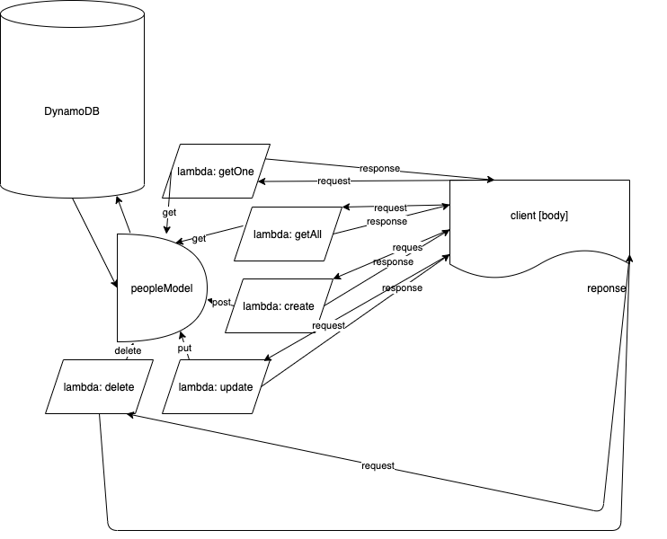

# Serverless API
### Aysia Brown

### UML

What is the root URL to your API?
- [Root URL](https://3qrllvoc29.execute-api.us-west-2.amazonaws.com/people)

What are the routes?
- [GET /people/{id}](https://3qrllvoc29.execute-api.us-west-2.amazonaws.com/people/{id})
- [POST /people](https://3qrllvoc29.execute-api.us-west-2.amazonaws.com/people)
- [GET /people](https://3qrllvoc29.execute-api.us-west-2.amazonaws.com/people)
- [PUT /people/{id}](https://3qrllvoc29.execute-api.us-west-2.amazonaws.com/people/{id})
- [DELETE /people/{id}](https://3qrllvoc29.execute-api.us-west-2.amazonaws.com/people{id})

What inputs do they require?
- GET & DELETE /people/{id} requires an ID as a param of the person you are getting
- PUT /people/{id} requires an ID as a param of the person you would like to update as well as a body of `{name: EnterName, age: EnterAge, gender: EnterGender}`
- POST /people requires a body of `{name: EnterName, age: EnterAge, gender: EnterGender}`

What output do they return?
- GET /people returns every record in the peopleModel of the  database
- GET /people/{id} returns the person with that given id 
- PUT /people/{id} returns the updated record of the given id
- DELETE /people/{id} returns 'Deletion was successful!' 
- POST /people returns the new record that was added 